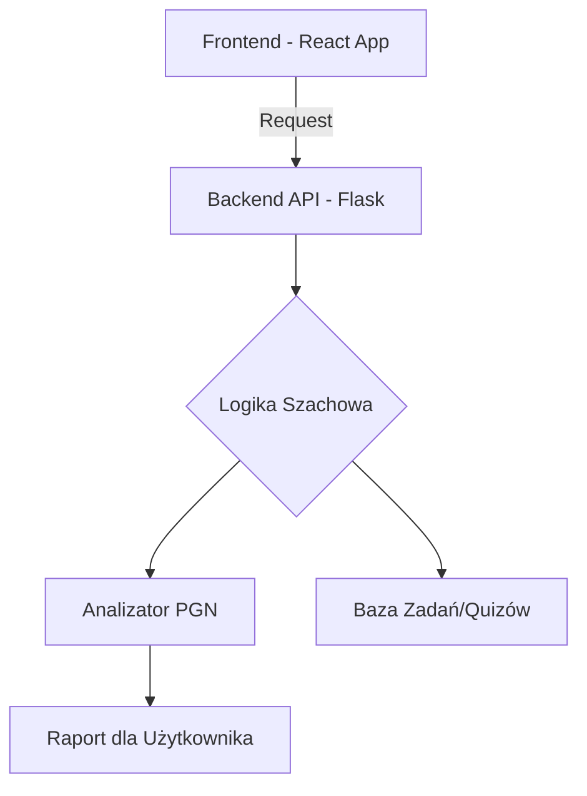

# ♟️ Szachowy Asystent Online – Edukacja & Interakcja

## 📌 Opis projektu
**Szachowy Asystent Online** to nowoczesna platforma edukacyjna stworzona z myślą o początkujących graczach. Projekt łączy interaktywną aplikację webową z bazą wiedzy, pomagając użytkownikom przejść drogę od poznania zasad do zrozumienia podstawowej taktyki.

Projekt jest manifestem połączenia:
* ♟️ **Pasji do szachów** – merytoryczne podejście do nauki.
* 💻 **Technologii webowych** – nowoczesny stack technologiczny.
* 📚 **Edukacji online** – przemyślana ścieżka użytkownika (UX).
* ✍️ **Personal Brandingu** – budowanie wizerunku eksperta w niszowej dziedzinie.

---

## 🎯 Cele projektu
* **Demokratyzacja wiedzy:** Uproszczenie skomplikowanych teorii szachowych.
* **Micro-learning:** Codzienne, krótkie interakcje zamiast wielogodzinnych wykładów.
* **Praktyka ponad teorię:** Nauka poprzez rozwiązywanie zadań w czasie rzeczywistym.
* **Integracja narzędziowa:** Stworzenie pomostu między blogiem edukacyjnym a narzędziem analitycznym.

---

## 🧠 Funkcjonalności

### 🧩 Interaktywny Quiz Szachowy
* Testowanie wiedzy z zakresu zasad gry i motywów taktycznych (związania, widełki, roszada).
* Natychmiastowy feedback i wyjaśnienie błędów.
* System progresu motywujący do regularnej nauki.

### ♜ Codzienne Wyzwania (Puzzles)
* Zadania typu „Mat w 1 ruchu” oraz „Mat w 2 ruchach”.
* Dynamiczne losowanie zadań z bazy danych.
* System podpowiedzi naprowadzający na poprawne rozwiązanie.

### 📈 Analiza partii (PGN)
* Możliwość wgrania pliku `.pgn` z własną partią.
* Automatyczna identyfikacja przełomowych momentów gry.
* Opisowa analiza błędów przygotowana językiem zrozumiałym dla amatora.

---

## 🧰 Technologie

### Frontend
* **React:** Budowa komponentowego, reaktywnego interfejsu.
* **HTML5 / CSS3:** Nowoczesny design z dbałością o dostępność (Accessibility).
* **Chess.js / React-Chessboard:** Biblioteki do renderowania i walidacji ruchów na szachownicy.

### Backend
* **Python (Flask/Django):** Logika biznesowa i przetwarzanie plików PGN.
* **REST API:** Komunikacja między warstwą prezentacji a bazą danych.
* **SQLite/PostgreSQL:** Przechowywanie zadań i wyników użytkowników.

---

## 🏗️ Architektura Systemu (High Level)

